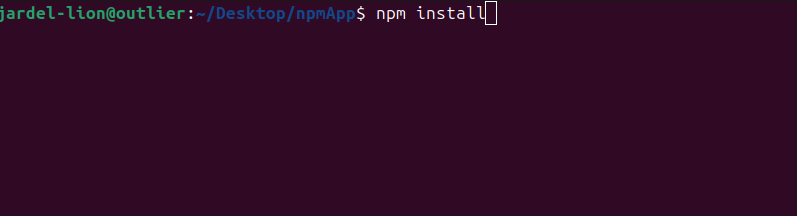

# Learning the essecials about npm
## In this active learning

0. npm init
1. npm instal
2. npm i <name-packge>
3. npm i <name-packge> --save
4. Learn about .gitignore

## This is the basic i learn how to use it
  If you want to clone this repo and install all the package just download and press **npm install**
  
  
